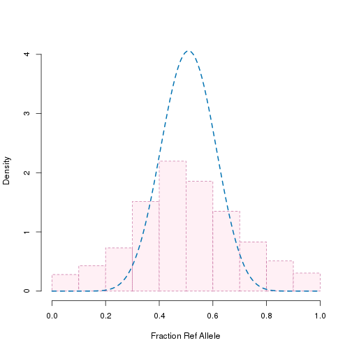

We will analyze a subset of one of the sample dataset for illustration
purposes.

```r
library(parallel)
library(npbin)
library(data.table)
library(VGAM)
#> Loading required package: methods
#> Loading required package: stats4
#> Loading required package: splines

minimum_coverage <- 5 # minimum total coverage allowed
n_cores <- detectCores() # the number of cores to be used, can ONLY be 1 if run on Windows.

dt <- atac
colnames(dt)
#>  [1] "chr"             "location"        "m"              
#>  [4] "xm"              "winning.chip"    "motif"          
#>  [7] "pval.mat.atSNP"  "pval.pat.atSNP"  "pval.rank.atSNP"
#> [10] "winnig.motif"    "potential_TP"    "potential_FP"
```


```r
dt.ct <- data.table(dt)[m >= minimum_coverage, ]
```

for illustration purpose, keep only the 2000 points, remove this line will
end up with analyzing the whole data set. It could be slow if only one core
is used.

```r
dt.ct <- dt.ct[1:2000, ]
dt.ct[, p_hat:=xm / m]
n <- nrow(dt.ct)
```

NPBin

```r
n_breaks <- 11 # number of breaks
spline_order <- 4 # order of splines
breaks <- seq(0, 1, length.out = n_breaks)
pi_init <- initialize_weights(
  dt.ct,
  n_breaks = n_breaks,
  spline_order = spline_order,
  plot = TRUE
) # initialized the weights using the histogram of p_hat
```


estimate the overall model

```r
overall_model_estimate <- emBinBspl(
  dt.ct[, xm],
  dt.ct[, m],
  breaks = breaks,
  k = spline_order,
  pi.init = pi_init,
  ncores = n_cores,
  err.max = 1e-3,
  iter.max = 200
)
names(overall_model_estimate)
#> [1] "pi"          "post"        "bspl"        "dmtx"        "f"          
#> [6] "ll.all"      "err.all"     "convergence" "controls"
```

estimate the null model

```r
null_model_estimate <- estNull(
  dt.ct[, xm],
  dt.ct[, m],
  overall_model_estimate,
  init = NULL,
  iter.max = 200,
  ncores = n_cores,
  ub = rep(log(1e4), 2),
  err.max = 1e-4
)
names(null_model_estimate)
#>  [1] "pi"               "post"             "bspl"            
#>  [4] "dmtx"             "f"                "ll.all"          
#>  [7] "err.all"          "convergence"      "controls"        
#> [10] "coef.null"        "pi0"              "f0"              
#> [13] "locfdr"           "convergence.null"
```


```r
null_model_estimate[["coef.null"]]
#> $shape1
#> [1] 13.41442
#> 
#> $shape2
#> [1] 12.97
#> 
#> $pi0
#> [1] 0.8604282
```

Calculate the [overdispersion/correlation parameter](https://en.wikipedia.org/wiki/Beta-binomial_distribution#Moments_and_properties)


```r
1 / sum(
  null_model_estimate[["coef.null"]][["shape1"]],
  null_model_estimate[["coef.null"]][["shape2"]],
  1
)
#> [1] 0.0365171
```

Plot the estimated null distribution


```r
plot_estimated_null(
  dt.ct[, p_hat],
  shape1_shape2 = c(
    null_model_estimate[["coef.null"]][["shape1"]],
    null_model_estimate[["coef.null"]][["shape2"]]
  )
)
```


