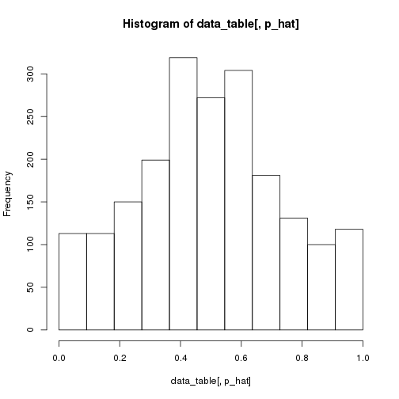

We will analyze a subset of one of the sample dataset for illustration
purposes.

```r
library(npbin)
library(data.table)

minimum_coverage <- 5 # minimum total coverage allowed
n_cores <- detectCores() # the number of cores to be used, can ONLY be 1 if run on Windows.
#> Error in detectCores(): could not find function "detectCores"

dt <- atac
colnames(dt)
#>  [1] "chr"             "location"        "m"              
#>  [4] "xm"              "winning.chip"    "motif"          
#>  [7] "pval.mat.atSNP"  "pval.pat.atSNP"  "pval.rank.atSNP"
#> [10] "winnig.motif"    "potential_TP"    "potential_FP"
```


```r
dt.ct <- data.table(dt)[m >= minimum_coverage, ]
```

for illustration purpose, keep only the 2000 points, remove this line will
end up with analyzing the whole data set. It could be slow if only one core
is used.

```r
dt.ct <- dt.ct[1:2000, ]
dt.ct[, p_hat:=xm / m]
n <- nrow(dt.ct)
```

NPBin

```r
n_breaks <- 11 # number of breaks
spline_order <- 4 # order of splines
breaks <- seq(0, 1, length.out = n_breaks)
pi_init <- initialize_weights(
  dt.ct,
  n_breaks = n_breaks,
  spline_order = spline_order,
  plot = TRUE
) # initialized the weights using the histogram of p_hat
```



estimate the overall model

```r
overall_model_estimate <- emBinBspl(
  dt.ct[, xm],
  dt.ct[, m],
  breaks = breaks,
  k = spline_order,
  pi.init = pi_init,
  ncores = n_cores,
  err.max = 1e-3,
  iter.max = 200
)  
#> Error in mclapply(1:(length(bspl) - 1), function(ii) bsplfun.updt(ii, : object 'n_cores' not found
```

estimate the null model

```r
null_model_estimate <- estNull(
  dt.ct[, xm],
  dt.ct[, m],
  overall_model_estimate,
  init = NULL,
  iter.max = 200,
  ncores = n_cores,
  ub = rep(log(1e4), 2),
  err.max = 1e-4
)
#> Error in estNull1(mod, pseq, ncores = ncores): object 'overall_model_estimate' not found
names(null_model_estimate)
#> Error in eval(expr, envir, enclos): object 'null_model_estimate' not found
```


```r
null_model_estimate$coef.null
#> Error in eval(expr, envir, enclos): object 'null_model_estimate' not found
```
